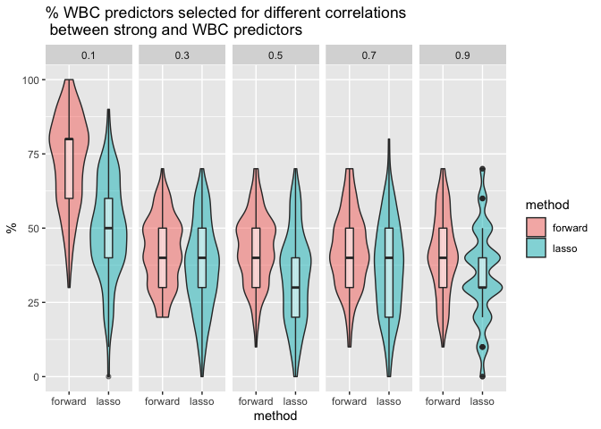

output_analysis
================

## Varying correlation between strong and WBC indicators

Load simulation output:

``` r
forward_cor_simdata <- read_csv("./simulation_outputs/varying_corr_out_forward.csv")
```

    ## New names:
    ## Rows: 500 Columns: 7
    ## ── Column specification
    ## ──────────────────────────────────────────────────────── Delimiter: "," dbl
    ## (7): ...1, cor_val, pct_strong_vec, pct_wai_vec, pct_wbc_vec, type1_erro...
    ## ℹ Use `spec()` to retrieve the full column specification for this data. ℹ
    ## Specify the column types or set `show_col_types = FALSE` to quiet this message.
    ## • `` -> `...1`

``` r
lasso_cor_simdata <- read_csv("./simulation_outputs/varying_corr_out_lasso.csv")
```

    ## New names:
    ## Rows: 500 Columns: 7
    ## ── Column specification
    ## ──────────────────────────────────────────────────────── Delimiter: "," dbl
    ## (7): ...1, cor_val, pct_strong_vec, pct_wai_vec, pct_wbc_vec, type1_erro...
    ## ℹ Use `spec()` to retrieve the full column specification for this data. ℹ
    ## Specify the column types or set `show_col_types = FALSE` to quiet this message.
    ## • `` -> `...1`

Change the above data to long format for easier visualization

``` r
forward_cor_simdata_cleaned <- forward_cor_simdata %>% 
  select(-1) %>% 
  mutate(cor_val = factor(cor_val)) %>% 
  pivot_longer(cols = c(pct_strong_vec, pct_wai_vec, pct_wbc_vec, type1_error_vec, power_vec),
                           names_to = "metric") %>% 
  mutate(method = "forward")

forward_cor_simdata_cleaned
```

    ## # A tibble: 2,500 × 4
    ##    cor_val metric          value method 
    ##    <fct>   <chr>           <dbl> <chr>  
    ##  1 0.1     pct_strong_vec  100   forward
    ##  2 0.1     pct_wai_vec     100   forward
    ##  3 0.1     pct_wbc_vec      80   forward
    ##  4 0.1     type1_error_vec  20   forward
    ##  5 0.1     power_vec        92   forward
    ##  6 0.1     pct_strong_vec  100   forward
    ##  7 0.1     pct_wai_vec      80   forward
    ##  8 0.1     pct_wbc_vec      50   forward
    ##  9 0.1     type1_error_vec  13.3 forward
    ## 10 0.1     power_vec        72   forward
    ## # … with 2,490 more rows

``` r
lasso_cor_simdata_cleaned <- lasso_cor_simdata %>% 
  select(-1) %>% 
  mutate(cor_val = factor(cor_val)) %>% 
  pivot_longer(cols = c(pct_strong_vec, pct_wai_vec, pct_wbc_vec, type1_error_vec, power_vec),
                           names_to = "metric") %>% 
  #group_by(cor_val, metric) %>% 
  #summarize(mean_pct = mean(value))
  mutate(method = "lasso")

combined_cor_simdata <- rbind(forward_cor_simdata_cleaned, lasso_cor_simdata_cleaned)
combined_cor_simdata
```

    ## # A tibble: 5,000 × 4
    ##    cor_val metric          value method 
    ##    <fct>   <chr>           <dbl> <chr>  
    ##  1 0.1     pct_strong_vec  100   forward
    ##  2 0.1     pct_wai_vec     100   forward
    ##  3 0.1     pct_wbc_vec      80   forward
    ##  4 0.1     type1_error_vec  20   forward
    ##  5 0.1     power_vec        92   forward
    ##  6 0.1     pct_strong_vec  100   forward
    ##  7 0.1     pct_wai_vec      80   forward
    ##  8 0.1     pct_wbc_vec      50   forward
    ##  9 0.1     type1_error_vec  13.3 forward
    ## 10 0.1     power_vec        72   forward
    ## # … with 4,990 more rows

Compare the probability of correctly selecting strong, wai, wbc
indicators for forward selection and LASSO, respectively:

``` r
# WBC
combined_cor_simdata %>% 
  filter(metric == "pct_wbc_vec") %>% 
  ggplot(aes(x = method, y = value)) +
  geom_violin(alpha = 0.5, width = 1, aes(fill = method)) + 
  geom_boxplot(alpha = 0.5, width = 0.2) +
  #geom_jitter(alpha = 0.8, width = 0.2, aes(color = method)) +
  facet_wrap(~cor_val, nrow = 1) +
  labs(title = "% WBC predictors selected for differeent correlations \n between strong and WBC predictors",
       y = "%")
```

<!-- -->

``` r
# WAI
combined_cor_simdata %>% 
  filter(metric == "pct_wai_vec") %>% 
  ggplot(aes(x = method, y = value)) +
  geom_violin(alpha = 0.5, width = 1, aes(fill = method)) + 
  geom_boxplot(alpha = 0.5, width = 0.2) +
  #geom_jitter(alpha = 0.8, width = 0.2, aes(color = method)) +
  facet_wrap(~cor_val, nrow = 1) +
  labs(title = "% WAI predictors selected for differeent correlations \n between strong and WBC predictors",
       y = "%")
```

<!-- -->

Compare the power and type-1 errors for forward selection and LASSO,
respectively:

``` r
# power
combined_cor_simdata %>% 
  filter(metric == "power_vec") %>% 
  ggplot(aes(x = method, y = value)) +
  geom_violin(alpha = 0.5, width = 1, aes(fill = method)) + 
  geom_boxplot(alpha = 0.5, width = 0.2) +
  #geom_jitter(alpha = 0.8, width = 0.2, aes(color = method)) +
  facet_wrap(~cor_val, nrow = 1) +
  labs(title = "Power (%) for differeent correlations between strong and WBC predictors",
       y = "%")
```

<!-- -->

``` r
# Type-1 error
combined_cor_simdata %>% 
  filter(metric == "type1_error_vec") %>% 
  ggplot(aes(x = method, y = value)) +
  geom_violin(alpha = 0.5, width = 1, aes(fill = method)) + 
  geom_boxplot(alpha = 0.5, width = 0.2) +
  #geom_jitter(alpha = 0.8, width = 0.2, aes(color = method)) +
  facet_wrap(~cor_val, nrow = 1) +
  labs(title = "Type-1 error rate (%) for differeent correlations \n between strong and WBC predictors",
       y = "%")
```

<!-- -->
